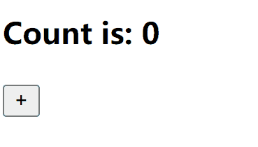

## Negozio

An atomic state management prototype for React 18+

## Install

```sh
# via npm
npm i --save negozio

# via yarn
yarn add negozio

# via pnpm
pnpm i negozio
```

## Usage

* use-count.js

```js
import createAtom from 'negozio'

export default createAtom(0)
```

* count-button.jsx

```jsx
import useCount from '/path/to/use-count'

export default function CountButton() {
  const [, setCount] = useCount()
  return <button onClick={() => setCount(c => c + 1)}>
    +
  </button>
}
```

* count-display.jsx

```js
import useCount from '/path/to/use-count'

export default function CountDisplay() {
  const [count] = useCount()
  return <h3>Count is: {count}</h3>
}
```

* App.jsx

```jsx
import CountButton from '/path/to/count-button'
import CountDisplay from '/path/to/count-display'

export default function App() {
  return <div>
    <CountDisplay />
    <CountButton />
  </div>
}
```



> [!NOTE]
> The `createAtom` function can accept complex values other than string, number, such as array and object.
> It is based on the hook [`useSyncExternalStore`](https://react.dev/reference/react/useSyncExternalStore) in React 18

## LICENSE

MIT
